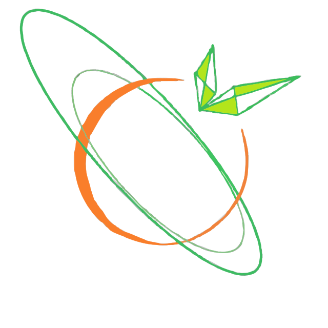
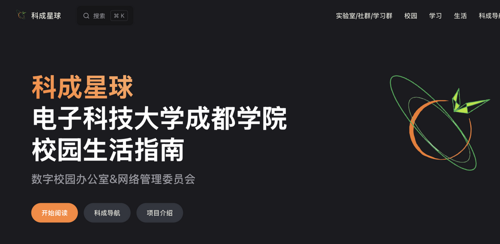
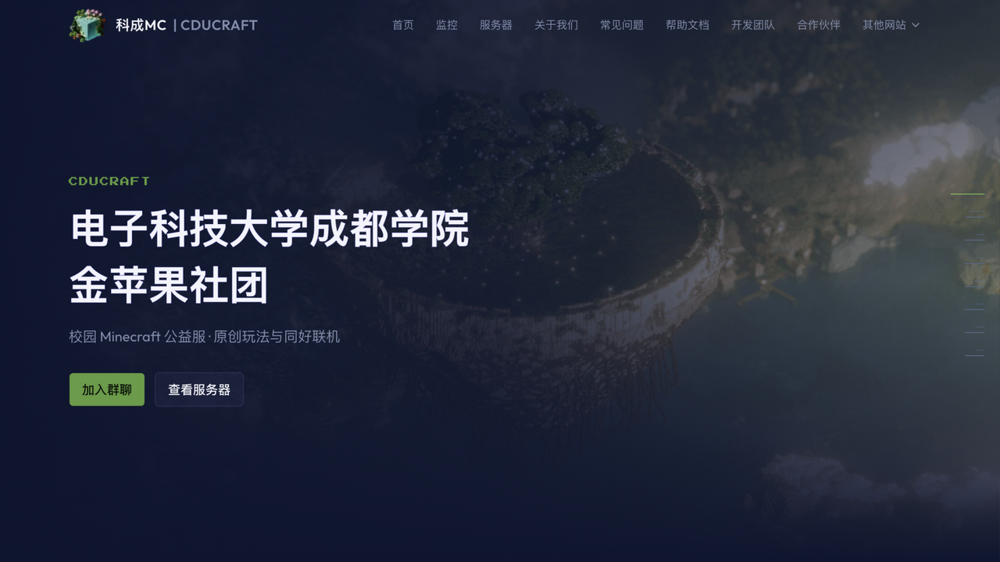
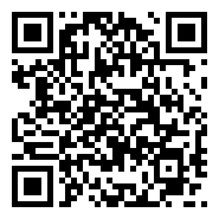
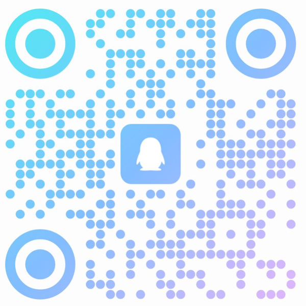

  

<h1 align="center">科成星球 · kchub-dev</h1>

  <strong>电子科技大学成都学院校园数字生态</strong>

  围绕校园知识与社区项目，持续整理和建设学生可以使用、反馈与参与的开源项目。

  <a href="#项目方向">项目方向</a> ·
  <a href="#开源项目">开源项目</a> ·
  <a href="#参与共建">参与共建</a> ·
  <a href="#社团资料">社团资料</a>

---

## 项目方向

kchub-dev 维护和整理与电子科技大学成都学院校园生活相关的开源项目。项目从实际需求出发，覆盖校园信息与兴趣社区。

## 开源项目

以下展示当前组织中适合公开展示的开源项目。项目图取自对应官网首屏；后续可替换为更合适的项目截图、认证或成果图片。

### 科成星球 Wiki

<table>
<tr>
<td width="58%" valign="top">
  
  
官网：<a href="https://wiki.kcos.club/">wiki.kcos.club</a>

</td>
<td valign="top">
  
电子科技大学成都学院第三方公益校园生活百科。

  <ul>
    <li>校园信息与生活指南</li>
    <li>持续维护的开放内容</li>
    <li><a href="https://wiki.kcos.club/">访问在线版</a></li>
  </ul>
  
仓库：<a href="https://github.com/kchub-dev/cduestc-wiki">kchub-dev/cduestc-wiki</a>

</td>
</tr>
</table>

### 科成 MC 社区项目

<table>
<tr>
<td width="58%" valign="top">
  
  
官网：<a href="https://mc.cduestc.fun/">mc.cduestc.fun</a>

</td>
<td valign="top">
  
电子科技大学成都学院 Minecraft 公益服务器官网及相关社区项目。

  <ul>
    <li>官网与服务器状态展示</li>
    <li>社区玩法与帮助文档</li>
    <li>开发团队与合作伙伴介绍</li>
  </ul>
  
仓库：<a href="https://github.com/kchub-dev/cduestc-mc">kchub-dev/cduestc-mc</a>

</td>
</tr>
</table>

## 参与共建

- 浏览公开仓库，了解项目当前进展。
- 通过 Issue 反馈问题、补充链接或提出建议。
- 通过 Pull Request 参与文档、代码和资料整理。
- 加入项目组 QQ 群：[1027931860](http://qm.qq.com/cgi-bin/qm/qr?_wv=1027&k=b5xzyCga9ARuCjngtAtQM2UbifBdYPzw&authKey=8r%2FZWZKc21rMnDLjBRpo21H420NXt33AA7pEgiYt3u9Nfe5pBuIX26XK0U1IaIUO&noverify=0&group_code=1027931860)。
- 通过 [reply@cduestc.fun](mailto:reply@cduestc.fun) 联系项目维护者。

## 社团资料

**社团 B 站**：关注社团动态与活动内容　|　**社团 QQ**：加入社团交流与项目讨论

<table>
<tr>
<td width="50%" align="center" valign="top">
  
   
  <strong>社团 B 站</strong>
   
  关注社团动态与活动内容
</td>
<td width="50%" align="center" valign="top">
  
   
  <strong>社团 QQ</strong>
   
  加入社团交流与项目讨论
</td>
</tr>
</table>

---

  科成星球 · kchub-dev — 项目内容与图片会持续更新，欢迎提交 Issue 或 Pull Request。

